# Christmas Sales

 

## Introduction
The "Christmas Sales Analysis Dashboard" project is part of the FP20 Analytics December 2024 Challenge 22. It involves analyzing holiday shopping patterns to uncover customer preferences, promotional effectiveness, and factors influencing satisfaction during the Christmas season. The project leverages a detailed dataset capturing customer demographics, purchase behaviors, and seasonal trends to provide actionable insights for optimizing future holiday strategies.

## Problem Statement
Holiday shopping during the Christmas season is a crucial period for retailers, characterized by distinct customer behavior, high sales volumes, and promotional campaigns. The objective of this project is to answer key business questions such as:

1. How do sales volumes fluctuate during Christmas compared to other periods in the dataset?

2. What are the age and gender distributions of customers making purchases during Christmas?

3. Which regions or cities show the highest sales volumes during Christmas, and how do these trends compare to non-Christmas periods?

4. What is the effect of promotions on sales during Christmas? Are specific promotions more effective than others?

5. Which products are most popular during Christmas, and how do these preferences vary by age, gender, or location?

6. How do customer satisfaction scores differ for Christmas purchases compared to non-Christmas transactions?

7. What percentage of orders during Christmas include gift wrapping, and which demographics are most likely to use this service?

8. Are express shipping options more popular during the Christmas period? How does delivery time correlate with customer satisfaction?

9. What are the main reasons for product returns during Christmas, and do these differ from returns during other periods?

10. How do weather (e.g., snowy, sunny) or specific Christmas events (e.g., "Christmas Market") influence sales and customer behaviour?

## Skills Demonstrated
- **Data Analysis**: Conducting in-depth analysis using statistical and data visualization techniques.
- **Advanced DAX Formula Creation**:
  - Calculated Columns
  - Complex Measures
  - Dynamic Formatting
  - Conditional Logic
- **Dashboard Design**: Building an interactive dashboard in Power BI with a focus on usability and clarity.
- **Data Transformation**: Cleaning and transforming raw data into meaningful datasets.
- **Insight Presentation**: Extracting and presenting insights aligned with business questions.

## Data Sourcing
The dataset is provided by a leading market research firm and includes:
- Transaction details (date, location, sales, products, etc.).
- Customer demographics (age, gender).
- Promotional data.
- Satisfaction scores.
- Weather conditions during purchases.
- And More

More Information About This Challenge: [FP20 Analytics Challenge 22](https://zoomcharts.com/en/microsoft-power-bi-custom-visuals/challenges/fp20-analytics-december-2024)

## Data Transformation
To ensure accurate analysis, the following transformations were applied:
- Cleaned and structured the dataset for accurate analysis.
- Ensured data consistency and accuracy through normalization and data type adjustments.
  - Adjustment in specific Columns
    
  | Before | After |
  |----------|----------|
  | 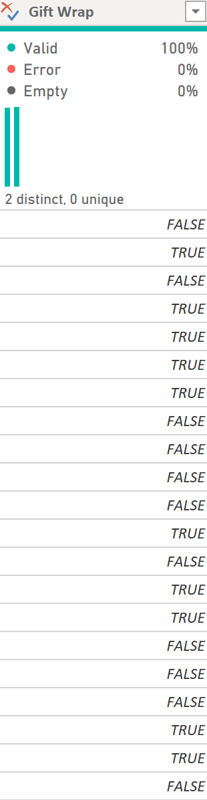 | 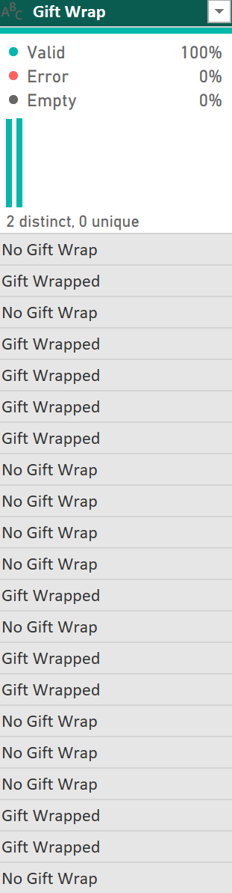 |
  | 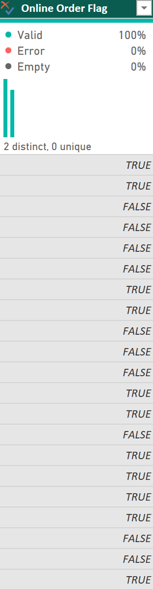 | 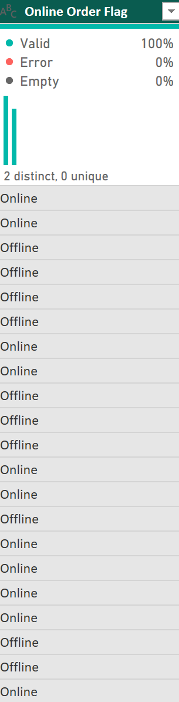 |
  | 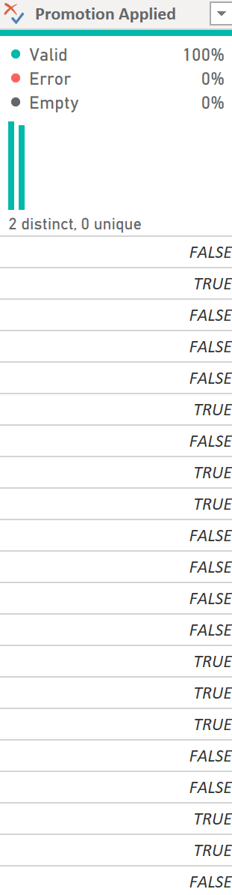 | 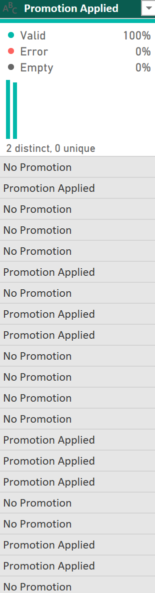 |
  | 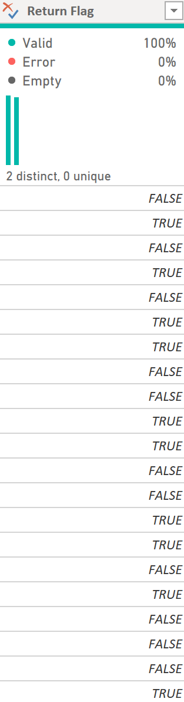 | 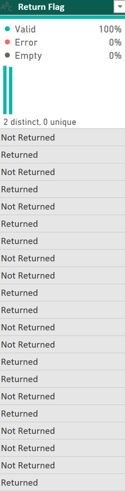 |
  | 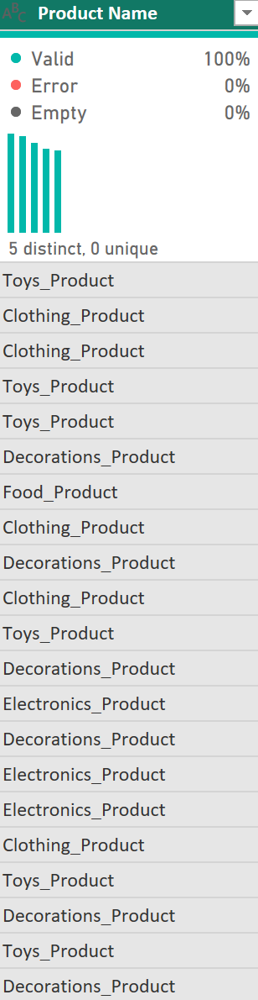 | 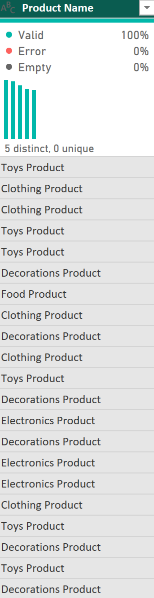 |
  -  Final Result
  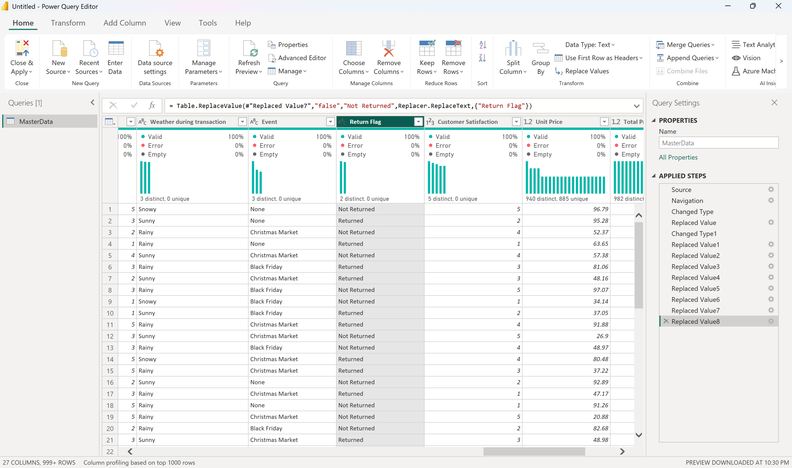 

- Data Analysis: Extracting trends and patterns from transactional data.
- Data Transformation: Using advanced tools (e.g., DAX) to create calculated columns and measures for in-depth analysis.
   - Created calculated columns using DAX measures to enhance data exploration
     
    | Dax | Result |
  |----------|----------|
  | 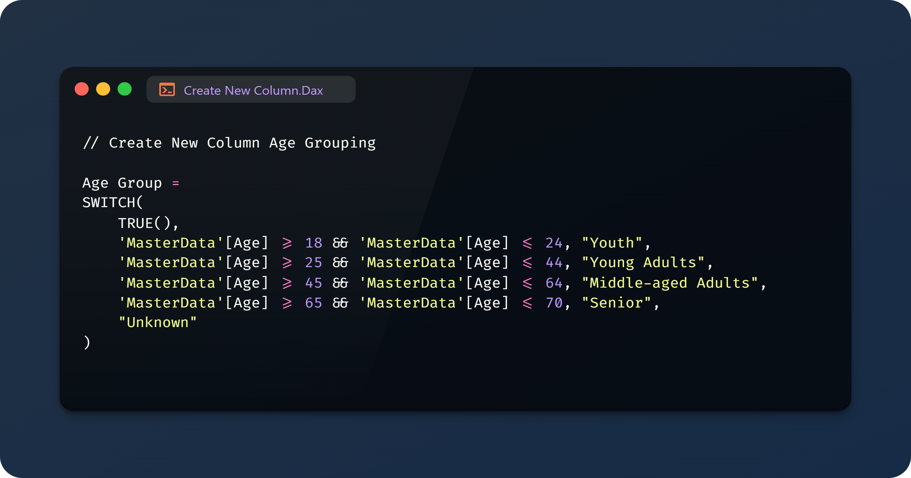 | 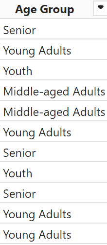 |
  | 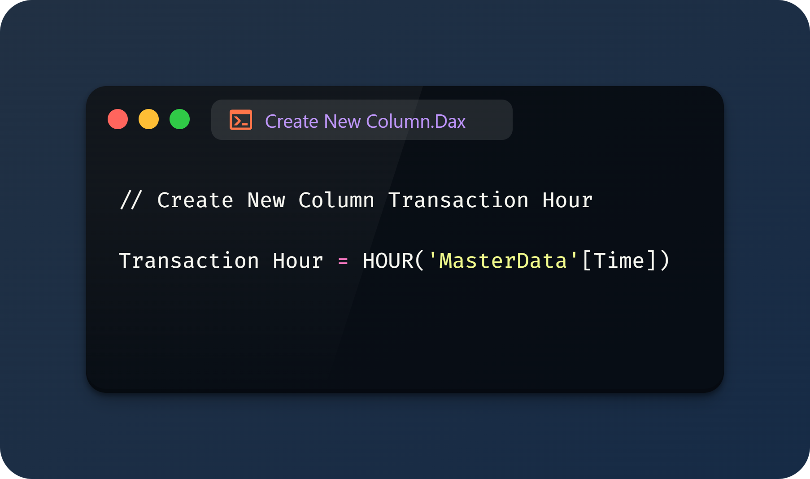 | 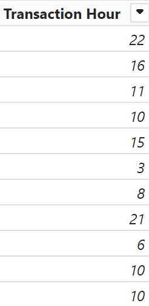 |
  | 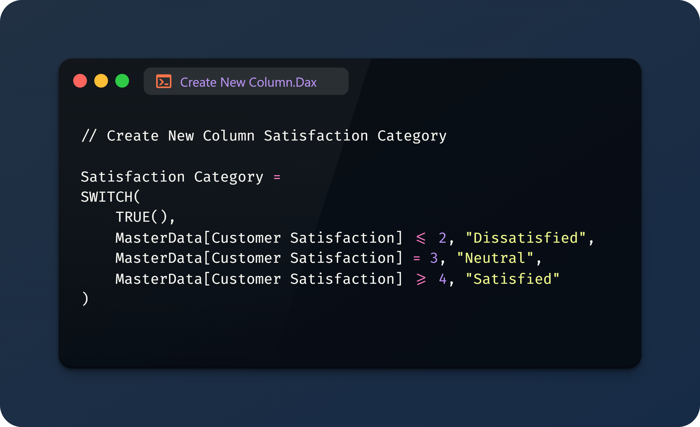 | 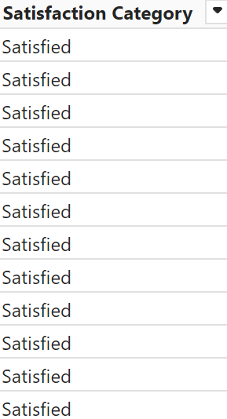 |
   
- Visualization: Designing interactive dashboards to present insights clearly and effectively.
- Business Intelligence: Deriving actionable recommendations from analytical findings.

## Modeling
The analysis used a descriptive analytics approach, focusing on summarizing historical data to identify trends and patterns. Several DAX measures were created to perform calculations for analysis:
- **Core DAX Measures**:

  - Calculated Total
    
  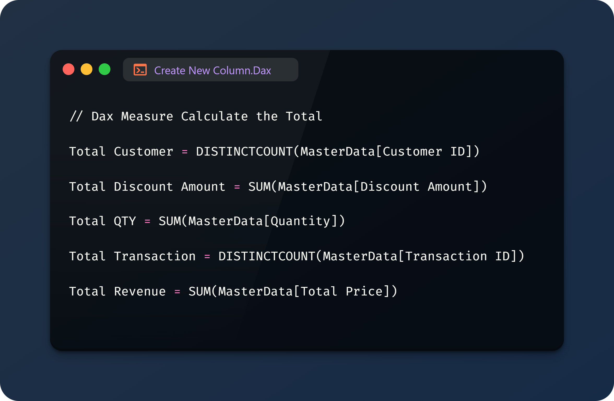

  - Calculated Average
    
  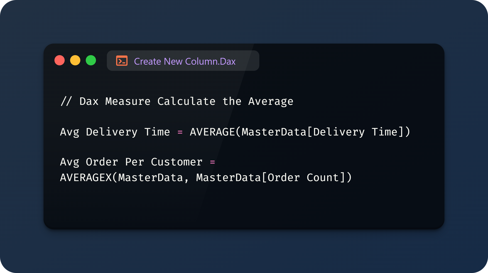

 - Rate Percent %
   
  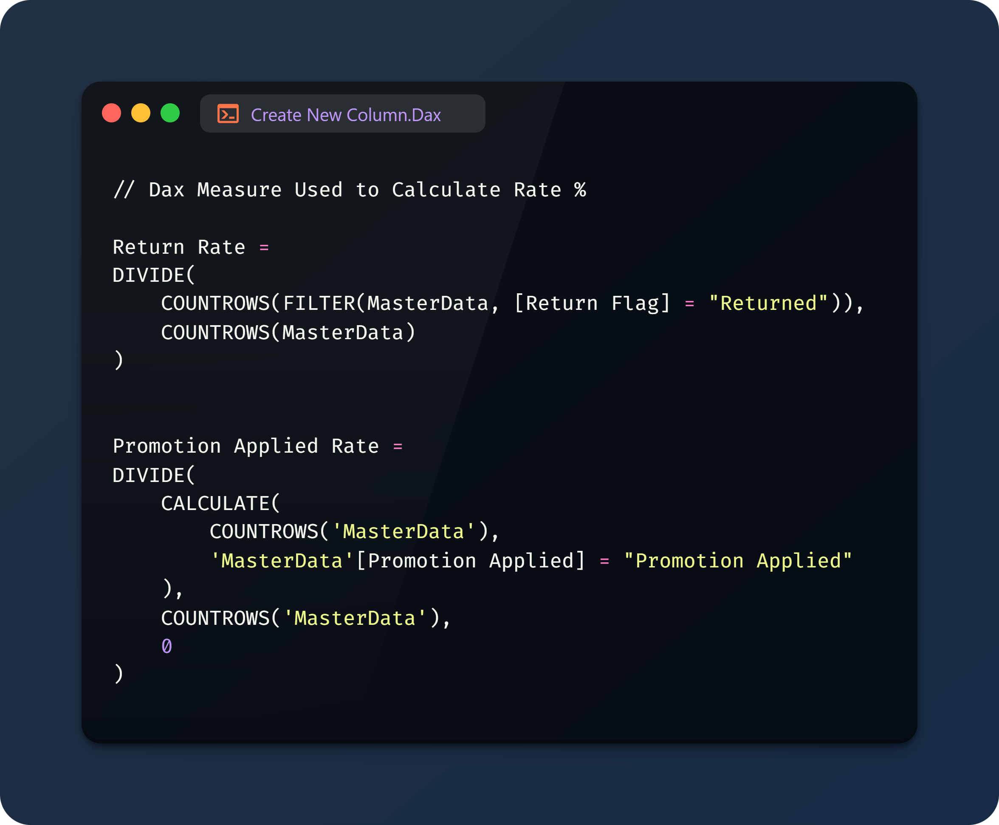

 - Store Ranking
   
  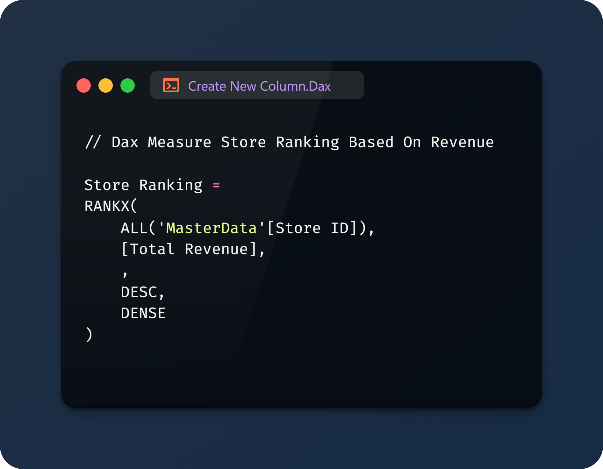

- **Advanced DAX Measures**:
  
 - Reference Label & KPI

   - Reference Label 
     
  

   - Top 1
     
  

 - Conditional Formating for Color

   - Top 1
  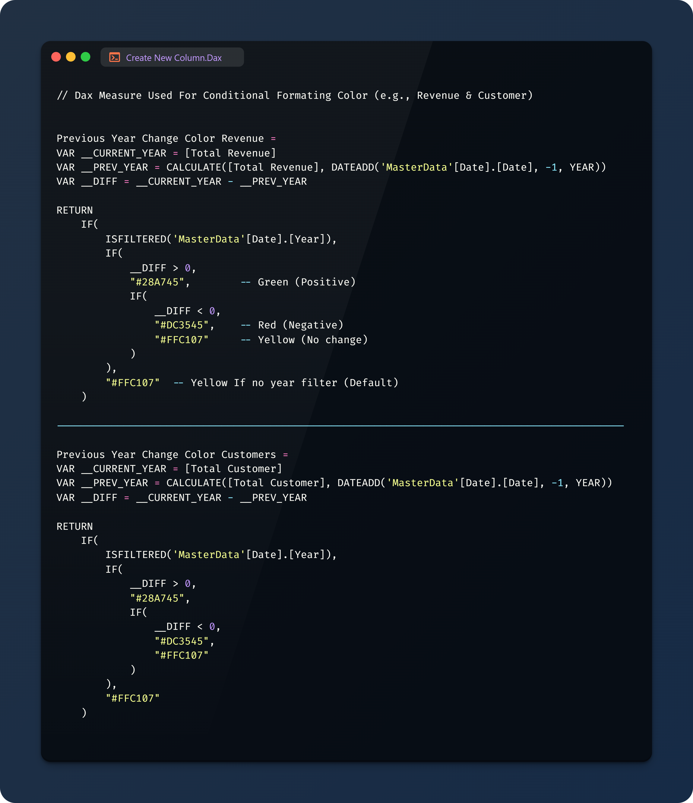

## Analyze & Visualization
The analysis focuses on:
- Seasonal sales patterns with peaks during Christmas.
- Customer demographics driving revenue.
- Regional sales distribution highlighting high-performing stores.
- Shipping methods’ correlation with customer satisfaction.
- Product popularity and gift wrap usage by age group.

In this Dashboard there are 2 pages :
- Overview
- Details

You can interact with report here [FP20 Analytics Challenge 22](https://app.powerbi.com/view?r=eyJrIjoiOThlY2IyNWUtYTYzMC00NDcyLTllMGMtOTAzNTJjZjk0NDZmIiwidCI6IjQ2NTRiNmYxLTBlNDctNDU3OS1hOGExLTAyZmU5ZDk0M2M3YiIsImMiOjl9)

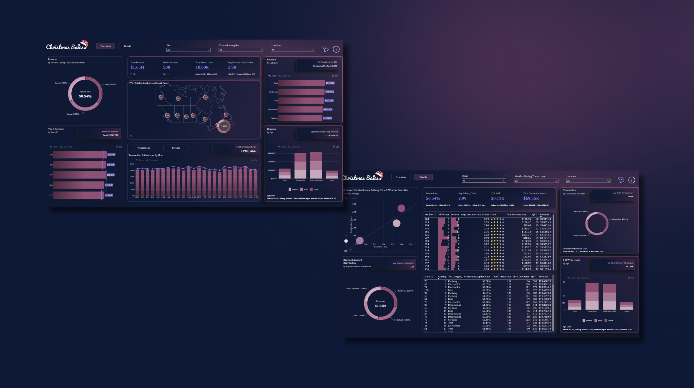 

## Conclusion & Recomendation

Conclusion
1. Sales Volumes During Christmas
Sales volumes consistently peak during December, with significant contributions from Christmas Markets. Christmas drives substantial revenue, with peaks reaching $49K and a total revenue of $1.65M across the dataset. This demonstrates the critical importance of leveraging the holiday season to maximize sales through strategic campaigns.

2. Age and Gender Distributions
Young adults (25–44) and middle-aged adults (45–64) are the primary drivers of revenue, with age 21 being the highest revenue-generating group ($39,247K). Slightly higher satisfaction among females (3.00 vs. 2.97) suggests potential for targeted gender-specific promotions during Christmas.

3. Regional Sales Trends
The eastern region consistently shows the highest sales volumes with 6.92K Qty sold, supported by strong performances from top stores (e.g., Store IDs 28, 52, and 77, each generating $20K). Nationwide presence is evident through smaller distribution centers, highlighting opportunities for region-specific holiday marketing campaigns.

4. Promotion Effectiveness
Promotion application rates average around 50-51%, with top stores like Store 28 maintaining a strong 50% rate during Christmas. This suggests that promotions play a significant role in driving sales.

5. Product Popularity During Christmas
Electronics dominate as the most popular product category, with 6,226 units sold and $386.65K in revenue. Clothing and Food categories follow with $320.88K and $332.61K, respectively. Younger demographics appear to favor gift wrapping and electronics, presenting an opportunity to bundle these services.

6. Customer Satisfaction for Christmas Purchases
Average satisfaction during Christmas remains steady at 2.98 out of 5. Customers are slightly more satisfied with express delivery (3.03) compared to standard options (2.95), indicating the importance of prioritizing faster shipping options during the holiday season to enhance customer experience.

7. Gift Wrapping and Demographics
Gift wrapping peaks during Christmas, with young adults generating 119 orders including gift wraps. Product ID 527 shows the highest usage with 14 wraps. This service correlates positively with higher satisfaction scores, suggesting that emphasizing gift wrapping promotions during Christmas could boost customer satisfaction and loyalty.

8. Shipping Preferences During Christmas
Express delivery is more popular during Christmas, with higher satisfaction scores (3.03) compared to standard and overnight options. Average delivery time remains competitive at 2.99 days. These insights emphasize the value of ensuring efficient shipping methods to meet holiday demand.

9. Reasons for Returns During Christmas
Return rates average 50.54%, with slight variations by weather. Returns during Christmas may be influenced by customer expectations and weather, suggesting a need for clearer return policies and improved product descriptions.

10. Weather and Event Impacts
Clear weather and events like Christmas Markets positively influence sales and customer behavior. These factors, combined with a strong seasonal presence, highlight opportunities to tailor marketing efforts to align with favorable conditions and popular events.

Recomendation

1. Seasonal Campaigns: Focus on maximizing sales during December with targeted promotions, especially for electronics and gift wrapping services.
2. Demographic Targeting: Tailor marketing efforts towards young and middle-aged adults, leveraging gender-specific insights.
3. Regional Strategies: Allocate resources to high-performing regions while exploring growth opportunities in underperforming areas.
4. Enhanced Shipping: Prioritize express delivery options during the holiday season to improve customer satisfaction.
5. Promotion Optimization: Refine promotion types and timing to maximize their impact on sales.
6. Returns Mitigation: Implement proactive measures, such as better product descriptions and transparent return policies, to address high return rates during Christmas.
7. Weather-Sensitive Campaigns: Align marketing efforts with weather patterns and capitalize on the influence of clear weather and holiday events.
